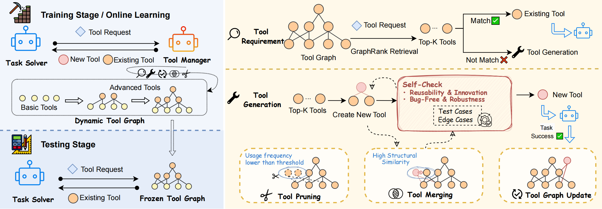

# GATE: Graph-based Adaptive Tool Evolution Across Diverse Tasks

## Overview


## Quick Start
### Install Python Packages
```
pip install -r requirements.txt
```
### Set OPENAI API KEY
```
export OPENAI_API_KEY=<openai_api_key>
```
### Build Tool Graph
```python
python run.py --task_type <task_type> --dataset_path <dataset_path> --toolkit_path <toolkit_path> --output_path <output_path> [--resume]
```
#### Arguments
- task_type: (Required) Type of task, e.g., date, text, number, etc. This argument specifies the kind of task the Agent will train on.
- dataset_path: (Required) Path to the dataset in JSONL format (line-delimited JSON).
- toolkit_path: (Required) Path to the toolkit directory, which contains the necessary configuration and tools for training.
- output_path: (Required) Directory where the output files will be saved.
- log_dir: (Optional) Directory to store log files (default is logs).
- resume: (Optional) If specified, the training will resume from the last checkpoint.
### Evaluation
#### Code Generation Tasks
```python
python test_code_generation.py --task_type <task_type> --test_path <test_data_path> --model_name <llm_model_name> --exp_name <experiment_name> --toolkit_path <toolkit_path> --solving_sys_prompt <sys_prompt_path>
```
#### Agent Tasks
```python
python test_agent_task.py --task_type <task_type> --test_path <test_data_path> --model_name <llm_model_name> --exp_name <experiment_name> --toolkit_path <toolkit_path> --solving_sys_prompt <sys_prompt_path> --train_output <train_output_path>
```
##### Arguments
- task_type: Type of task to test (e.g., MATH, Date, TabMWP).
- test_path: Path to the test dataset (JSONL format).
- model_name: Name of the LLM model to be tested.
- exp_name: Name of the experiment.
- toolkit_path: Path to the toolkit directory.
- solving_sys_prompt: Path to the system prompt file.
- temperature: Temperature for LLM output (default: 0.3).
- max_tokens: Maximum tokens for LLM (default: 1024).
- top_p: Top-p sampling for LLM (default: 0.9).
- top_k_query: Number of top queries to process (default: 3).
- top_k_tool: Number of top tools to process (default: 3).
- test_mode: Mode of the test (e.g., standard, advanced).
- retry_times: Number of retries for a test case (default: 5).
- debug_times: Number of debug retries (default: 0).
- is_primitive: Flag to use primitive tools (optional).
- has_demo: Flag to include a demo (optional).
- tool_mode: Tool mode for the framework (default: “direct_tool”).
- basic_tools: List of basic tools for the framework.
### Open-Ended Tasks
The online training and evolution of the tool graph in the Minecraft environment will be launched soon.
### Evaluation on Open-Source Model
To evaluate the model, you first need to download the model weights from Hugging Face and then deploy the model using `vllm`. Here is an example of how to deploy model.
```python
python -m vllm.entrypoints.openai.api_server \
 --host 0.0.0.0 \
 --port <your-port> \
 --gpu-memory-utilization <utilization> \
 --served-model-name <model-name> \
 --model <path-to-model> \
 --tensor-parallel-size <size> \
 --cpu-offload-gb <size> \
 --max-num-seqs <number> \
 --trust-remote-code \
 --uvicorn-log-level error
```